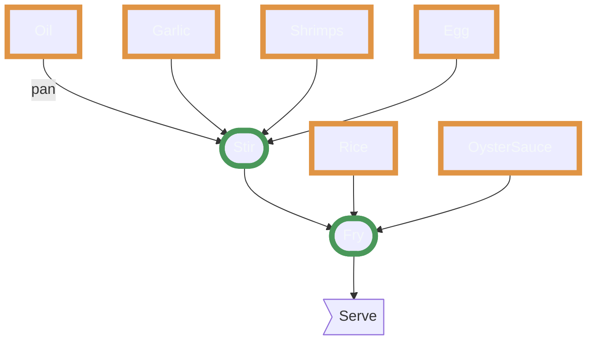

```mermaid
	flowchart TD;
        classDef steps stroke:#4a985a,stroke-width:6px,color:#F4F8FA
        classDef spices stroke:#336791,stroke-width:6px,color:#F4F8FA
        classDef ingredients stroke:#e09444,stroke-width:6px,color:#F4F8FA
		Oil-->|pan|Stir([Stir]);
		Garlic-->Stir;
		Shrimps-->Stir;
		Egg-->Stir-->Fry([Fry]);
		Rice-->Fry;
		OysterSauce-->Fry-->Serve>Serve];
        class Oil,Garlic,Shrimps,Egg,Rice,OysterSauce ingredients;
        class Salt,Sugar spices;
        class Stir,Fry steps;
```
